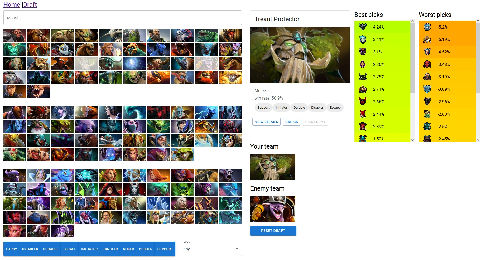

# Dota 2 Team Drafter

[Preview here](https://dota2-team-drafter.herokuapp.com/)

From Wikipedia:
>_**Dota 2**_ is a 2013 [multiplayer online battle arena](https://en.wikipedia.org/wiki/Multiplayer_online_battle_arena "Multiplayer online battle arena") (MOBA) video game developed and published by [Valve](https://en.wikipedia.org/wiki/Valve_Corporation "Valve Corporation"). _Dota 2_ is played in matches between two teams of five players, with each team occupying and defending their own separate base on the map. Each of the ten players independently controls a powerful character known as a "hero" that all have unique [abilities](https://en.wikipedia.org/wiki/Skill_(role-playing_games) "Skill (role-playing games)") and differing styles of play.

A central aspect of the strategy in a game of Dota 2 revolves around the _"drafting phase"_ before the game begins, where teams take turns choosing their heroes. There are many factors that determine a hero's synergy within your own team and the counter-play it presents to your opposing team's draft.

With 19 quadrillion possible hero combinations each game, how does the average player decide what to pick? With a React SPA, dummy 🙂

The purpose of this tool is to:
 1. Simulate a live drafting environment without the need for launching the client.
 2. Provide key information to assist in the drafting process in real time.

## Features

 - Display a list/grid of all heroes
    - Searchable by text
    - Filterable by role buttons
    - Route to a detailed card when individually selected
 - Connect to the [OpenDota API](https://www.opendota.com/) to retrieve basic game info and populate the grid
 - Simulate the process of drafting two teams
 - Retrieve detailed match statistics from the OpenDota API and present those in the drafting process
    - win rate
    - item builds
 - Advantage List (i.e synergy/counterpick suggestions)

 
